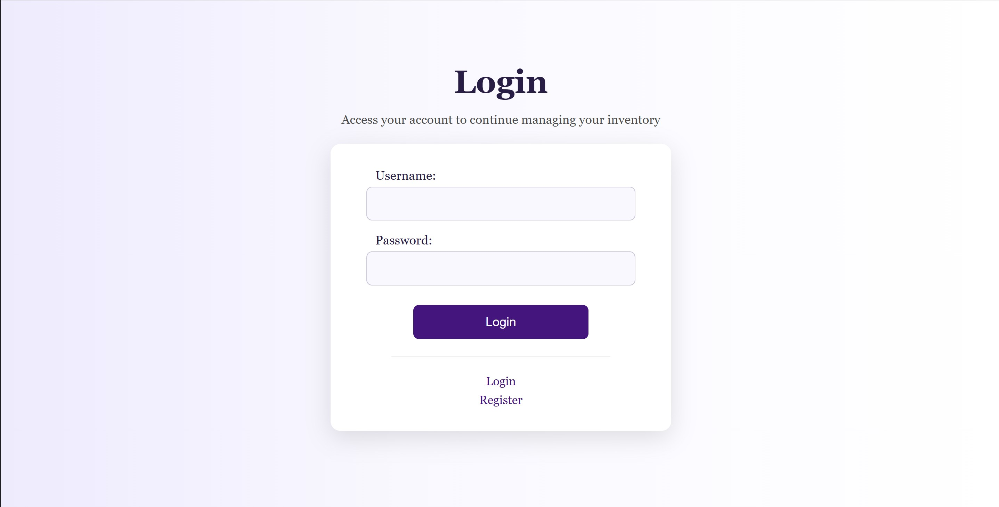
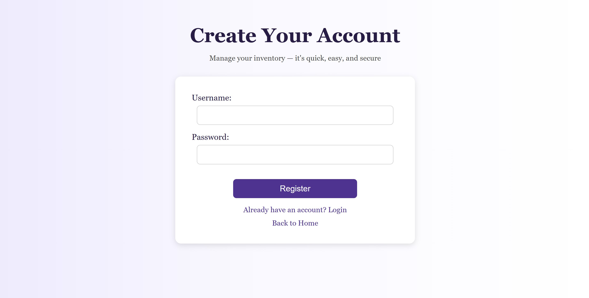
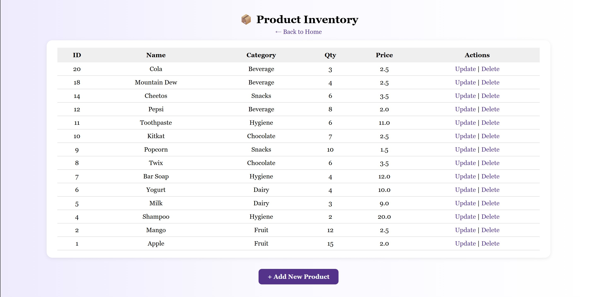
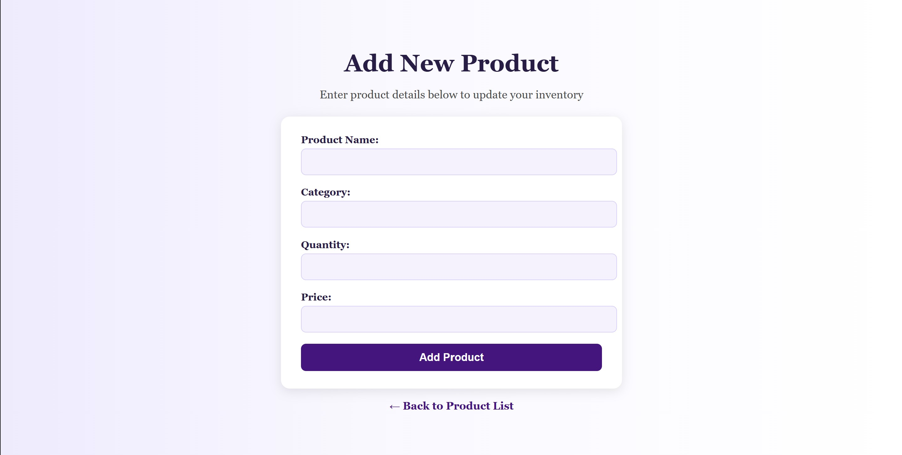
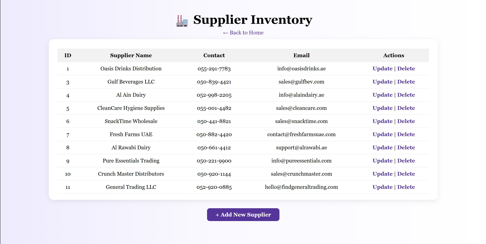
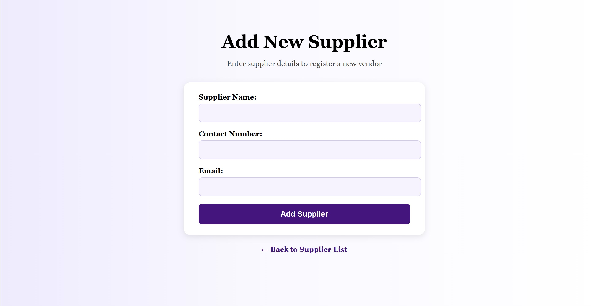

# Inventory Management System (MVC)

A Java-based web application for managing products and suppliers, built using the MVC architecture.

The system allows users to perform full CRUD operations, manage inventory data, and maintain supplier records through a clean and simple interface.

---

## 🚀 Features

- User authentication (login & register)
- Product management (add, update, delete, view)
- Supplier management (add, update, delete, view)
- Session handling
- Clean and responsive UI

---

## ⚙️ System Design

This project follows the **MVC (Model–View–Controller)** architecture:

- **Model:** Java classes (Product, Supplier, User)
- **View:** JSP pages (UI)
- **Controller:** Java Servlets (request handling)
- **Database:** MySQL using DAO pattern

---

## 🧠 How It Works

1. User logs into the system  
2. Requests are handled by Servlets (Controller)  
3. Business logic interacts with DAO classes  
4. DAO communicates with the MySQL database  
5. Results are sent back to JSP pages (View)  

---

## 📸 Screenshots

### 🔐 Authentication

### 📦 Product Management

### 🏭 Supplier Management

---

## 📄 Documentation

Full project report with system design and implementation details:

👉 [View Full Report](report_G1.pdf)

---

## 👨‍💻 Contribution

This project was completed as part of a university assignment.  
I was responsible for the full implementation of the system, including:

- Designing the MVC architecture  
- Implementing backend logic using Servlets  
- Creating DAO classes and database integration  
- Building the frontend using JSP and CSS  
- Developing all CRUD operations and system functionality  

---

## 🎯 Purpose

The goal of this project was to apply core software engineering concepts such as MVC architecture, database design, and full-stack web development using Java.

---

## 🛠 Technologies Used

- Java (Servlets)
- JSP
- MySQL
- JDBC
- Apache NetBeans
- GlassFish Server

---
